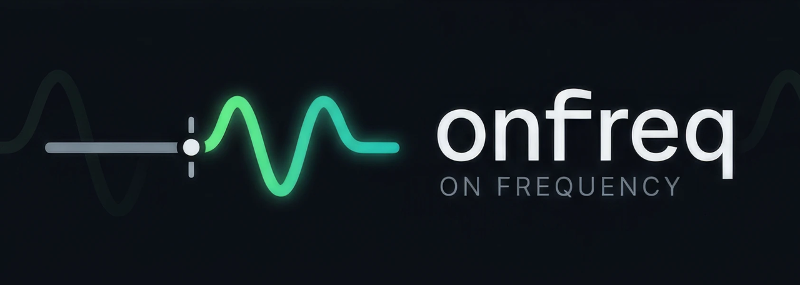
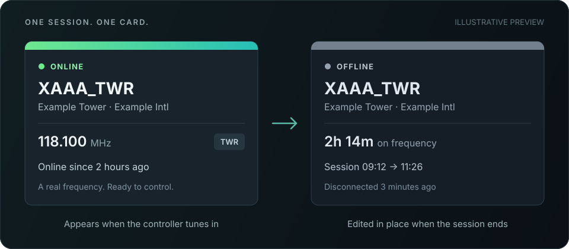

  

<h1 align="center">IVAO ATC, live in Discord.</h1>

  Live session cards, airspace coverage and optional approval reminders. 
  Built with TypeScript and Cloudflare Workers.

  
  
  

- Choose which FIRs and Discord channels to monitor.
- Cards appear when controllers tune in and turn grey when they disconnect.
- Coverage rosters, reconnect grace and durable retries keep updates useful.
- Optional approval reminders follow your privately configured policy.

## Get started

You need Node.js 24, Cloudflare and your own Discord bot. Follow the **[setup guide](docs/setup.md)** for deployment and optional Mac monitoring.

Public delivery is at least once. This is self-hosted software, not a hosted bot service.

## Contribute

Open an [issue](https://github.com/EMOEMOJAI/onfreq/issues/new/choose) to discuss a bug or idea. Maintainer changes go directly to main after checks; please do not open pull requests.

Run `npm ci`, `npm run lint:docs`, `npm run typecheck` and `npm test`. CI also checks secrets, dependencies, workflows, shell scripts and macOS helpers. Coding agents: see [AGENTS.md](AGENTS.md).

[Security & privacy](SECURITY.md) · [MIT license](LICENSE)

Community-built; not an official IVAO or Discord product.
